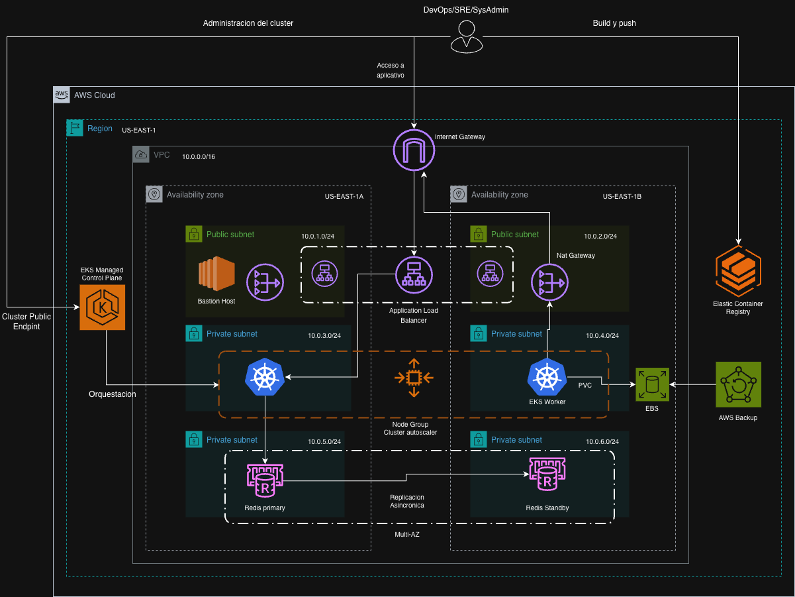

# Obligatorio – Implementación de Soluciones Cloud

## Descripción

Este repositorio contiene el desarrollo del obligatorio de la materia **Implementación de Soluciones Cloud**.

El proyecto consiste en la automatización del despliegue de una aplicación basada en **microservicios** sobre **Amazon Web Services (AWS)** utilizando **Terraform** como herramienta de Infraestructura como Código (IaC) y **Amazon Elastic Kubernetes Service (EKS)** como plataforma de orquestación de contenedores.

Toda la infraestructura se encuentra completamente automatizada, permitiendo desplegar el ambiente desde cero mediante Terraform y posteriormente publicar la aplicación utilizando Docker, Amazon ECR y Kubernetes.

El procedimiento completo de despliegue se encuentra documentado en [`docs/despliegue.md`](docs/despliegue.md), donde se detallan los pasos necesarios para aprovisionar la infraestructura, configurar el clúster EKS y desplegar la aplicación.

---

# Objetivos

Los principales objetivos del proyecto son:

- Automatizar completamente la creación de la infraestructura en AWS mediante Terraform.
- Implementar una arquitectura basada en microservicios desplegada sobre Amazon EKS.
- Utilizar Kubernetes como plataforma de orquestación de contenedores.
- Implementar alta disponibilidad mediante el uso de múltiples Availability Zones.
- Optimizar la asignación de IPs para pods mediante VPC CNI con prefix delegation.
- Ejecutar los workloads de la aplicación en subnets privadas.
- Publicar el frontend mediante Kubernetes Ingress, AWS Load Balancer Controller y un Application Load Balancer público.
- Permitir el escalado automático de los servicios mediante Horizontal Pod Autoscaler (HPA).
- Utilizar Amazon ElastiCache Redis para almacenar el estado del carrito de compras.
- Implementar persistencia para componentes internos del clúster mediante PVC, StorageClass gp3 y Amazon EBS.
- Incorporar observabilidad mediante métricas, dashboards, alertas y logs centralizados.
- Mantener toda la infraestructura y configuración versionada en el repositorio.

---

# Arquitectura General

La solución implementada está compuesta por una arquitectura desplegada en AWS sobre una VPC propia, distribuida en múltiples Availability Zones. La aplicación se ejecuta en un clúster de Amazon EKS dentro de subnets privadas, mientras que el acceso público al frontend se realiza mediante un Application Load Balancer ubicado en subnets públicas y administrado desde Kubernetes mediante AWS Load Balancer Controller.

Los principales componentes de la arquitectura son:

- Amazon VPC con subnets públicas y privadas.
- Internet Gateway para la salida/entrada pública controlada.
- NAT Gateway para salida a Internet desde recursos privados.
- Bastion Host para tareas administrativas.
- Amazon EKS con Managed Node Group y VPC CNI configurado con prefix delegation.
- Amazon ECR para almacenar las imágenes Docker de los microservicios.
- AWS Load Balancer Controller para crear y administrar el Application Load Balancer desde un Ingress de Kubernetes.
- Amazon ElastiCache Redis en modalidad Multi-AZ para el estado del carrito.
- Amazon EBS para volúmenes persistentes utilizados por componentes del clúster mediante PVC/PV.
- AWS Backup para respaldos de volúmenes EBS etiquetados.
- Metrics Server para habilitar HPA.
- kube-prometheus-stack para métricas, dashboards y alertas.
- Grafana Loki y Promtail para centralización y consulta de logs desde Grafana.

La aplicación se compone de múltiples microservicios independientes. El frontend se publica mediante un Ingress de Kubernetes procesado por AWS Load Balancer Controller, el cual crea automáticamente un Application Load Balancer público. El ALB redirige el tráfico hacia el Service `frontend-external`, expuesto como NodePort, y desde allí hacia los pods del frontend. Los demás microservicios se consumen internamente dentro del clúster.

## Diagrama de arquitectura



---

# Tecnologías utilizadas

| Tecnología | Uso |
|------------|-----|
| Terraform | Infraestructura como Código |
| AWS | Plataforma Cloud utilizada para la solución |
| Amazon VPC | Red principal del entorno |
| Subnets públicas y privadas | Segmentación de recursos expuestos y privados |
| Amazon EKS | Kubernetes administrado para ejecutar los microservicios |
| VPC CNI Prefix Delegation | Optimización de asignación de IPs para aumentar la densidad de pods por nodo |
| Kubernetes | Orquestación de contenedores |
| Docker | Construcción y empaquetado de microservicios |
| Amazon ECR | Registro privado de imágenes Docker |
| Amazon ElastiCache Redis | Almacenamiento del estado del carrito de compras |
| Amazon EBS | Volúmenes persistentes para componentes del clúster |
| AWS Backup | Respaldos de volúmenes EBS etiquetados |
| AWS Load Balancer Controller | Publicación del frontend mediante Ingress y Application Load Balancer |
| Metrics Server | Obtención de métricas para HPA |
| Horizontal Pod Autoscaler | Escalado automático de pods |
| Cluster Autoscaler | Escalado automático de nodos del clúster |
| Prometheus | Recolección de métricas del clúster y workloads |
| Grafana | Visualización de métricas y logs |
| Alertmanager | Gestión de alertas |
| Grafana Loki | Backend centralizado de logs |
| Promtail | Recolección de logs de pods/nodos hacia Loki |

---

# Estructura del repositorio

```text
Obligatorio-ISCloud/
│
├── aplicativo/
│   └── Obligatorio-Microservicios-main/
│       ├── src/                        # Código fuente de la aplicación de microservicios
│       └── pb/                         # Definiciones Protocol Buffers (gRPC)
│
├── IaC-Terraform/
│   ├── environments/
│   │   └── prod/                       # Configuración del entorno de producción
│   │
│   └── modules/
│       ├── backup/                     # AWS Backup
│       ├── ec2/                        # Bastion Host
│       ├── ecr/                        # Amazon ECR
│       ├── eks/                        # Amazon EKS y Node Groups
│       ├── elasticache/                # Amazon ElastiCache Redis
│       ├── igw/                        # Internet Gateway
│       ├── natgw/                      # NAT Gateway
│       ├── route-tables/               # Tablas de ruteo
│       ├── security-groups/            # Security Groups
│       ├── subnets/                    # Subredes públicas y privadas
│       └── vpc/                        # Virtual Private Cloud
│
├── docker/
│   ├── README.md                       # Documentación del build/push de imágenes
│   └── build-and-push.sh               # Construcción y publicación de imágenes Docker en ECR
│
├── docs/
│   ├── despliegue.md                   # Guía de despliegue
│   └── DiagramaSC.drawio.png           # Diagrama de arquitectura
│
├── k8s/
│   ├── hpa/                            # Horizontal Pod Autoscaler
│   ├── metrics-server/                 # Metrics Server
│   ├── monitoring/                     # Prometheus, Grafana, Loki y Promtail
│   └── generate-manifests.sh           # Generación automática de manifiestos
│
├── deploy-eks.sh                       # Despliegue de la aplicación en EKS
├── eks-setup.sh                        # Configuración inicial del clúster
├── frontend-request-test.sh            # Script de prueba de requests contra el frontend
│
├── LICENSE
└── README.md
```

# Observabilidad

La solución incorpora una capa de observabilidad integrada al clúster EKS. Para métricas se utiliza `kube-prometheus-stack`, que incluye Prometheus, Grafana, Alertmanager, kube-state-metrics y node-exporter. Prometheus recolecta métricas mediante scraping de endpoints internos del clúster, incluyendo kube-state-metrics para el estado de objetos Kubernetes, node-exporter para métricas de nodos y kubelet/cAdvisor para métricas de pods y contenedores. Esto permite monitorear el estado del clúster, nodos, pods, deployments, consumo de CPU/memoria, reinicios, PVCs y otros recursos de Kubernetes.

Para logs se incorpora Grafana Loki como backend centralizado y Promtail como recolector. Promtail obtiene los logs de los pods desde los nodos del clúster y los envía a Loki. Grafana queda configurado con Loki como datasource, permitiendo consultar métricas y logs desde una misma interfaz.

Por facilidad de acceso durante el desarrollo y la demostración del obligatorio, Grafana se publica mediante un Load Balancer. Esto permite acceder rápidamente a los dashboards desde Internet y validar el funcionamiento de la solución de observabilidad.

En un entorno productivo real, Grafana no debería quedar expuesto públicamente. El acceso recomendado sería privado, por ejemplo mediante una VPN corporativa, un bastion host, una red interna conectada a AWS por Site-to-Site VPN o Direct Connect, o mediante un Load Balancer interno restringido a rangos privados. De esta forma, la consola de monitoreo solo estaría disponible para usuarios administradores dentro de la red autorizada, reduciendo la superficie de exposición pública.

# Persistencia y backups

La aplicación no requiere una base de datos relacional, ya que el catálogo se carga desde archivos propios del servicio y el estado del carrito se almacena en Redis. Por este motivo, no se implementa Amazon RDS en la arquitectura.

ElastiCache Redis se despliega como replication group Multi-AZ con réplica y failover automático. Además, se configuran snapshots automáticos con retención de 7 días para respaldar el estado persistente asociado al carrito.

Para los componentes que requieren persistencia dentro del clúster, como Grafana, Prometheus o Loki, se utilizan PersistentVolumeClaims (PVC) en Kubernetes. Estos PVC se satisfacen mediante PersistentVolumes respaldados por Amazon EBS a través del EBS CSI Driver y la StorageClass `ebs-gp3`.

Los respaldos se gestionan mediante AWS Backup sobre los volúmenes EBS etiquetados para backup. De esta forma, la persistencia real se encuentra en EBS, mientras que los PVC/PV son los objetos de Kubernetes que permiten consumir ese almacenamiento desde los pods.

# Mejoras futuras

Como posibles mejoras futuras de la solución se identifican los siguientes puntos:

- Separar la aplicación en un namespace propio, por ejemplo `online-boutique` o `app`, en lugar de utilizar el namespace `default`. Esto permitiría mejorar la organización de los recursos, aplicar configuraciones específicas por entorno, definir límites de recursos por namespace y simplificar la administración de los manifiestos.

- Incorporar VPC Endpoints para ECR, S3, STS y otros servicios utilizados por los nodos privados. Actualmente los worker nodes acceden a ECR y servicios públicos de AWS mediante NAT Gateway, lo cual es funcional para el laboratorio, pero en producción podría optimizarse mediante endpoints privados.

- Incorporar reglas de `podAntiAffinity` o `topologySpreadConstraints` para distribuir las réplicas de los microservicios entre distintos nodos y Availability Zones. Esto permitiría mejorar la tolerancia a fallos, evitando que múltiples réplicas de un mismo servicio queden concentradas en un único nodo.

- Incorporar HPA para `currencyservice`. Durante las pruebas de estrés realizadas contra el frontend se observó que, además del propio frontend, el servicio de conversión de moneda podía verse afectado por el aumento de requests. Debido a que este microservicio participa en el flujo de visualización de productos y cálculo de precios, podría ser conveniente definir un Horizontal Pod Autoscaler específico para mejorar su respuesta ante picos de carga.

- Implementar IRSA para asignar permisos IAM específicos a los ServiceAccounts de componentes como AWS Load Balancer Controller, Cluster Autoscaler y EBS CSI Driver. En el laboratorio AWS Academy se utiliza el rol disponible del entorno debido a restricciones para crear el OIDC Provider.

- Evaluar la incorporación de trazas distribuidas para seguir el recorrido completo de una solicitud entre los distintos microservicios, identificando tiempos de respuesta, dependencias y posibles puntos de falla.

## Uso de Inteligencia Artificial

Durante el desarrollo de este proyecto se utilizaron herramientas de Inteligencia Artificial, principalmente ChatGPT y Codex, como apoyo para la revisión y mejora de fragmentos de código, infraestructura como código (IaC) y la redacción de la documentación técnica.

Todas las soluciones implementadas fueron analizadas, adaptadas y validadas por los integrantes del equipo antes de su incorporación al proyecto, asegurando que cada decisión técnica fuera comprendida y cumpliera con los objetivos planteados.

# Autores

- Fabricio Barreiro
- Santiago Hoaguy
